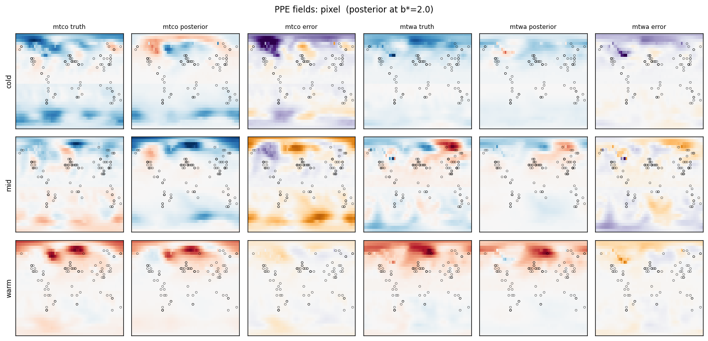
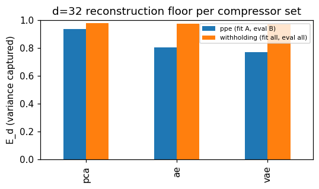
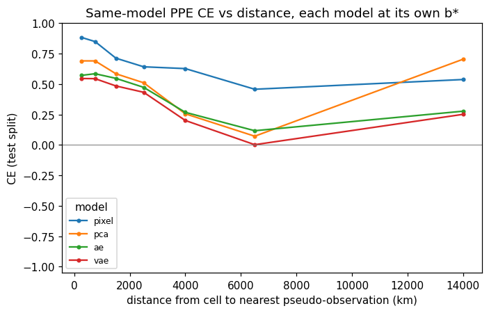
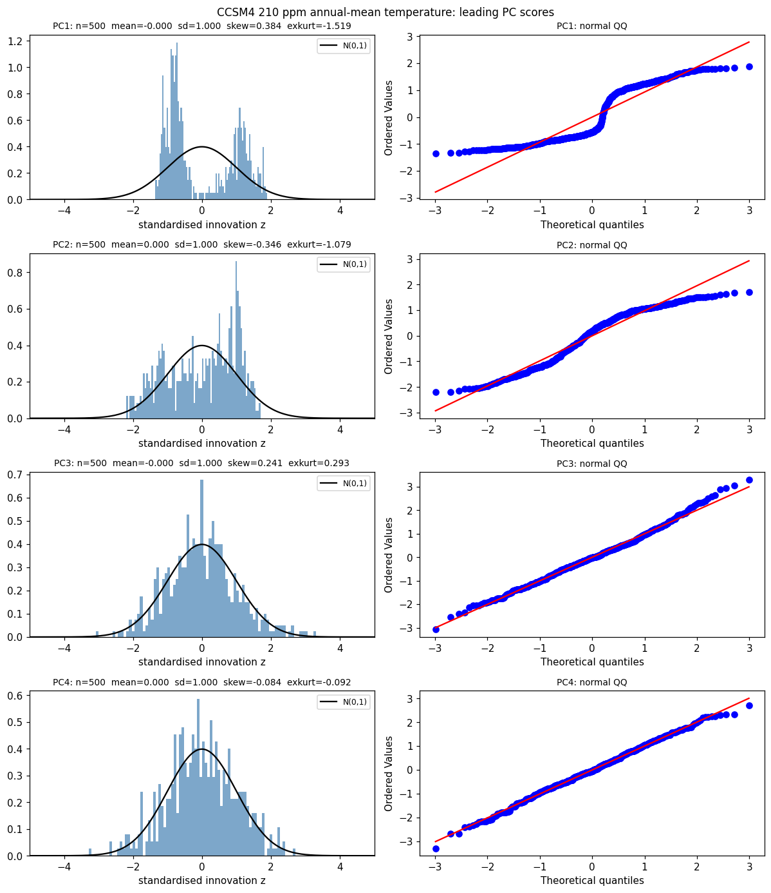

# Sparse paleoclimate field reconstruction

Reconstructing complete maps of ice-age temperature from scattered fossil-pollen
measurements, by Bayesian data assimilation of those measurements into a climate
simulation.

The target period is Marine Isotope Stage 3 (roughly 50 to 30 thousand years ago),
which contains Dansgaard-Oeschger events: abrupt North Atlantic warmings of 10-15 °C
within a decade. Two ingredients are combined. The LOVECLIM simulation of Menviel et
al. gives complete gridded maps but is an imperfect model of what happened. The
pollen-based reconstructions of Liu et al. give real measurements, but only at 187
scattered sites, each with its own uncertainty. Data assimilation conditions the
simulation on the measurements and returns a gridded field with per-cell uncertainty.

MSc Artificial Intelligence dissertation, Imperial College London.

## Status

The reconstruction pipeline and its evaluation harness are built and tested: 3DVar in
pixel space and in three learned latent spaces, scored on two evaluation lanes against
prior-free baselines. The generative (score-based diffusion) prior that motivates the
project is **not built**; see [Not implemented](#not-implemented) for the full list of
what remains.

The repository is not runnable as cloned. The raw data is several hundred megabytes,
third-party licensed, and not redistributed here; see
[Data and reproducibility](#data-and-reproducibility). The test suite runs without any
of it.

## The problem

Proxy networks are sparse and uneven. The Liu et al. network has 187 sites over the
30-49 ka window, 74% of them in the Northern Hemisphere, each carrying a bootstrapped
per-site error variance rather than one uniform noise level. The simulation covers
every grid cell but drifts from the observations: at co-located points its
coldest-month channel runs a median +9.7 °C warm.

Data assimilation is the standard way to combine the two. It treats the simulation as
a prior, the proxies as noisy observations, and returns a posterior over the field.
The step that makes it tractable is also its main limitation: prior and likelihood are both taken Gaussian, so the posterior is Gaussian. In a related constant-forcing simulation the distribution of plausible climate states at a fixed time is visibly bimodal, splitting between the stadial and interstadial regimes of the Atlantic overturning circulation, whereas a single Gaussian background covariance can only represent one mode. Closing that gap is what motivates a generative prior.

## What is built

| Area | Module | Contents |
| --- | --- | --- |
| Data | `paleoreco/data/` | LOVECLIM prior cube loader and cache, per-cell statistics, D-O-event-aware splits and purged blocked cross-validation, CCSM4 equilibrium-run loader and downloader |
| Models | `paleoreco/models/` | Convolutional autoencoder and β-VAE with longitude-wrapping padding |
| Training | `paleoreco/training/` | Training loops for both networks, masked losses, cross-validation driver |
| Assimilation | `paleoreco/assim/` | Observation loading, background state and covariance, innovation diagnostics, the method contract, pixel 3DVar, latent 3DVar, experiment runners |
| Evaluation | `paleoreco/eval/` | Skill and calibration metrics, skill-vs-distance, POD baseline, latent-space diagnostics, plotting |

Points worth calling out:

- **3DVar in gain form** (`assim/threedvar.py`). With nearest-cell selection as the
  observation operator the analysis has a closed form, so the dense 4096 x 4096
  background covariance is never inverted; the only inverse is over the handful of
  observations active at one age. The same factorisation yields the posterior variance
  map.
- **Per-site observation error.** R is a diagonal of the per-site variances that Liu
  et al. report, so each site contributes in proportion to its own confidence.
- **Background covariance regularisation** (`assim/priors.py`). Gaspari-Cohn distance
  localisation, shrinkage toward the diagonal, and a cross-channel coupling knob, all
  diagonal-preserving and composable.
- **Latent assimilation** (`assim/compressors.py`, `assim/latent.py`). One
  encode/decode contract covers PCA, the autoencoder and the VAE. The affine PCA
  decoder admits the exact latent gain; the neural decoders are linearised to their
  autograd Jacobian about the climatological code. All three return pixel-space
  results, so the metrics and drivers are method-agnostic.
- **Held-out operating-point selection** (`assim/experiments.py`). The covariance
  amplitude and, in pixel space, the taper configuration are chosen on a selection
  split and reported on a disjoint test split, with a prefer-the-simpler-config rule
  inside the selection tolerance.
- **Two evaluation lanes.** A same-model pseudo-proxy experiment where the truth is a
  held-out chronological half of the simulation, and 5-fold withholding of real proxy
  sites. Both emit skill, calibration and prior-free nearest-neighbour and
  inverse-distance-weighted reference rows into one tidy metrics schema.

`pytest tests/ -q` gives **87 passed**.

## Results

Same-model pseudo-proxy lane, pooled over both channels, on the test split, each
method at its own selected operating point. CE is the coefficient of efficiency
against a climatology baseline, so 0 means no better than doing nothing and 1 is
perfect. RMSE and rRMSE are in anomaly units.

| | CE | RMSE | rRMSE | SSIM |
| --- | --- | --- | --- | --- |
| pixel 3DVar | **0.687** | **0.648** | **0.560** | **0.693** |
| latent PCA-32 | 0.506 | 0.814 | 0.703 | 0.574 |
| latent AE-32 | 0.470 | 0.843 | 0.728 | 0.518 |
| latent VAE-32 | 0.416 | 0.885 | 0.764 | 0.501 |
| inverse-distance baseline | 0.347 | 0.936 | 0.808 | 0.436 |
| nearest-neighbour baseline | 0.231 | 1.016 | 0.877 | 0.336 |



Truth, posterior and error for a cold, a middling and a warm state; circles mark the
assimilated sites.

**Every assimilation beats the prior-free interpolators, and pixel 3DVar leads.**
Against the flat climatology it starts from, it cuts rRMSE from 1.0 to 0.560 and
raises structural similarity from 0.361 to 0.693.

**Latent assimilation does not beat pixel assimilation here.** The reason is a
reconstruction floor: an analysis cannot be more accurate than its own decoder. On
held-out states a 32-dimensional PCA basis retains 94% of the variance, against 81%
for the autoencoder and 77% for the VAE, and the assimilation skill orders the same
way.



The same ordering shows up upstream. In the latent-dimension sweeps the classical POD
basis beats the autoencoder for every dimension of 4 or more on the held-out block,
and beats the VAE at every dimension. The one place a neural encoder wins is the
autoencoder at d=2, where it retains 0.835 of the variance against POD's 0.718; the
VAE at d=2 collapses out of sample instead. The bottleneck is data volume, not
architecture: 804 states at 25-year
spacing with lag-1 autocorrelation around 0.9 for the coldest-month channel is a small
effective sample for a convolutional network.

**Calibration separates the methods more sharply than skill does.** At nominal 90%,
pixel 3DVar covers 0.971 with an RCRV dispersion of 0.766, which is mildly
over-cautious. The latent posteriors cover 0.32 to 0.51 with dispersion 3.1 to 5.0:
they are confidently wrong. The linearised pushforward of the latent covariance is the
likely cause, and it is a real limitation of the tangent-linear approach as
implemented.



Skill decays away from the proxy sites, which is the axis a sparse-network method is
judged on. The rise in the outermost bin runs against the otherwise monotonic decay
and should be read with caution; that bin is dominated by a few polar cells.

**Real-proxy withholding gives small numbers that need context.** Withheld-site CE is
0.082 for pixel, 0.068 for PCA and 0.057 for both neural latents. That is close to
zero, and it is close to zero by construction: a single site withheld from a sparse
network is largely unconstrained by its neighbours, so climatology is a strong
competitor. The comparison that carries information is against the prior-free
baselines on the same withheld sites, which score −0.041 (inverse-distance) and −0.459
(nearest-neighbour). Assimilation helps; it does not help much.

### Why a generative prior is the intended next step

The Gaussian assumption is testable, and it does not hold cleanly. Standardised
innovations pooled over sites and ages have a spread about 1.8 times what the
assumed covariances predict, with excess kurtosis around 11-13. Separately, in the
CCSM4 constant-CO₂ runs of Vettoretti et al., the leading principal component of the
equilibrated states at 210 ppm is visibly bimodal, matching the stadial and
interstadial regimes, while the negative control at 170 ppm below the oscillation
window is unimodal.



This is a motivating observation rather than a formal test: CCSM4 is not LOVECLIM, and
the result does not by itself establish bimodality in the prior actually assimilated
here.

## Pipeline

The notebooks are the consumers; `paleoreco/` holds the reusable code.

| Notebook | Purpose | Produces |
| --- | --- | --- |
| `01_eda` | Prior and observation exploration: mask, distributions, network sparsity and spatial bias, prior-observation residuals, temporal autocorrelation | inline figures only |
| `02_ae_arch_sweep` | Autoencoder capacity and optimiser sweeps under purged blocked cross-validation | sweep CSVs, winning architecture checkpoint |
| `03_ae_sweep_winner` | Winning architecture across a latent-dimension sweep, against a POD baseline; in-sample and held-out-event parts | metrics CSVs, figures, the d=32 checkpoints the latent assimilation loads |
| `04_vae_sweep` | Joint architecture and β sweep for the β-VAE, with latent-health diagnostics; no automatic winner | sweep CSVs, figures |
| `05_vae_sweep_winner` | Chosen β-VAE across the same latent-dimension sweep, plus generative diagnostics and an autoencoder comparison | metrics CSVs, figures, the d=32 checkpoints |
| `06_da_assumptions` | Tests the 3DVar error assumptions: innovation Gaussianity in one and two dimensions, and prior bimodality in the CCSM4 runs | diagnostic figures |
| `07_3dvar` | Pixel 3DVar: taper grid scan, operating-point selection, tuning landscape | pixel assimilation artefacts, tuning figure |
| `08_latent_3dvar` | Latent 3DVar over PCA-32, AE-32 and VAE-32, and the reconstruction floor that bounds them | three sets of assimilation artefacts, floor figure |
| `09_da_comparison` | Method-agnostic comparison across every assimilation run, on both lanes | comparison figures, skill maps, field galleries |

Notebook 09 discovers methods by globbing the metrics directory, so any method writing
the shared schema appears in the comparison without new plotting code.

## Method notes

- Everything is scored in anomaly space. CE, RMSE and correlation are shift-invariant,
  so those values carry over unchanged to degrees Celsius.
- The observation operator is nearest-cell selection, with longitude wrapping at the
  seam. Observations enter as anomalies against their own site climatology, so the
  systematic proxy-versus-model offset cancels rather than being assimilated as signal.
- The pseudo-proxy lane splits the age axis at its midpoint: the older half builds the
  background covariance and climatology, the younger half supplies truths. Each truth
  borrows several real network geometries, some for selection and a disjoint one for
  reporting, so the operating point is never chosen on the numbers reported.
- Latent results are re-centred as `decode(analysis) - decode(background) +
  background`, which removes a neural decoder's reconstruction error of the background
  from the reported field.
- CRPSS is scored against the same climatological reference that CE uses, so the two
  are read on a common baseline. Against real proxies the predictive variance carries
  the observation error as well, since the truth is itself a measurement.

## Not implemented

The dissertation proposes work beyond the Gaussian pipeline above. None of the
following exists in this repository:

- **A score-based diffusion prior** trained on the latent space, with observations
  entering through a likelihood-guided posterior score. This is the central proposed
  contribution and the reason for the compressor work; `paleoreco/models/` holds only
  the autoencoder architectures.
- **Residual-from-the-mean decomposition**, where a deterministic baseline captures the
  conditional mean and the generative model learns only the residual.
- **Transfer pre-training** on matching-resolution WeatherBench grids.
- **Ensemble Kalman filter and 4DVar baselines.** The comparison here runs 3DVar
  against prior-free interpolation only.
- **An explicit bimodality-recovery test** near D-O transitions, which is the test on
  which a Gaussian and a generative posterior are expected to differ most.
- **An imperfect-model evaluation lane** using the CCSM4 run as an out-of-distribution
  truth. The CCSM4 loader and downloader exist and are used for the prior-shape
  diagnostic, but no assimilation lane scores against them.

## Data and reproducibility

The raw data is not redistributed. Three sources are used, all obtained separately:

- **LOVECLIM MIS3 transient simulation** (Menviel et al. 2014), the prior. A 5.625°
  (32 x 64) grid at 25-year intervals over roughly 50 to 30 ka, 804 states, coldest-
  and warmest-season temperature standing in for MTCO and MTWA.
- **Pollen-based temperature reconstructions** (Liu et al.), the observations. 187
  sites usable on this grid over 749 ages, each with a per-site error variance.
- **CCSM4 constant-CO₂ equilibrium runs** (Vettoretti et al. 2022), used only for the
  prior-shape diagnostic. These are the one scripted fetch:
  `python -m paleoreco.data.download_ccsm4 <run_dir> [co2_ppmv]` pulls the single
  surface-temperature variable out of the remote archive by HTTP range request.

The expected local layout is a `data/` directory at the repository root holding
`Prior.csv`, `Observation.csv` and the downloaded CCSM4 `.npz` files; a derived cube
cache is written alongside them on first load. Trained checkpoints, figures and
assimilation artefacts are written under `outputs/`. Both directories are ignored, so
a fresh clone contains code, tests and the README figures only.

The test suite has no data dependency and runs on a clean checkout.

## Setup

Into a Python 3.12 virtual environment:

```bash
pip install -r requirements.txt
python -m pytest tests/ -q
```

NumPy, pandas, SciPy, PyTorch, scikit-learn, scikit-image, xarray.
Training was run on a CUDA machine; the assimilation runs on CPU in seconds to
minutes per lane.

## Layout

```
paleoreco/
  data/        prior cube, splits, CCSM4 equilibrium runs
  models/      convolutional autoencoder and beta-VAE
  training/    training loops, losses, cross-validation
  assim/       observations, priors, 3DVar, latent 3DVar, experiment runners
  eval/        skill and calibration metrics, diagnostics, plotting
notebooks/     01-09, the pipeline
tests/         unit and integration tests
docs/figures/  the figures used above
```

## References

- Menviel, L. et al. (2014). Hindcasting the continuum of Dansgaard-Oeschger
  variability. *Climate of the Past*.
- Liu et al. Global pollen-based temperature reconstructions across MIS3.
- Vettoretti, G. et al. (2022). Atmospheric CO₂ control of spontaneous
  millennial-scale ice age climate oscillations. *Nature Geoscience*.
- Hakim, G. J. et al. (2016). The Last Millennium Climate Reanalysis Project. *JGR
  Atmospheres*.
- Fan et al. (2025). Latent-space data assimilation for global atmospheric fields.
- Bousquet et al. (2025). Latent geometries of autoencoders for reduced-order
  modelling.
- Rozet, F. and Louppe, G. (2023). Score-based data assimilation. *NeurIPS*.
- Chung, H. et al. (2023). Diffusion posterior sampling for general noisy inverse
  problems. *ICLR*.
