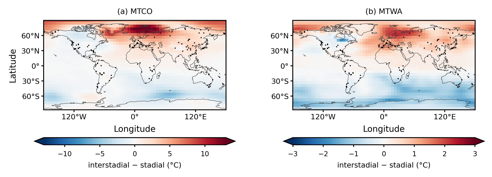
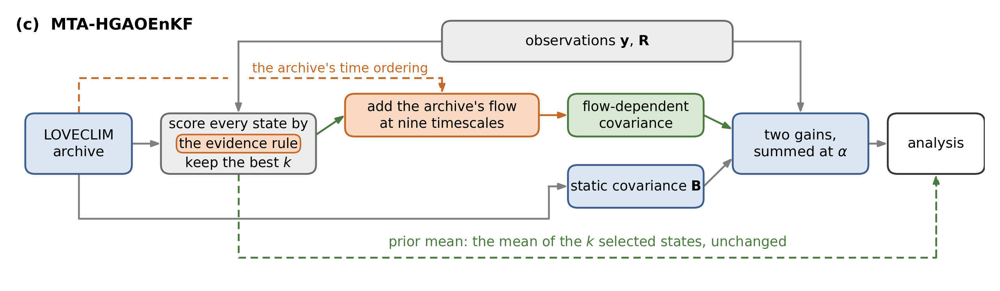
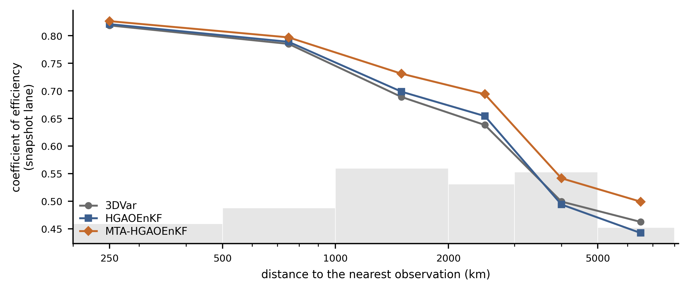

# Sparse paleoclimate field reconstruction

**Multiscale Tendency Augmentation for a Hybrid Gain Analog Offline EnKF in Paleoclimate Data
Assimilation: Spatially Complete Reconstruction of Dansgaard–Oeschger Temperature Fields across
Marine Isotope Stage 3**

MSc Computing individual project, Department of Computing, Imperial College London, 2026.\
Author: Evgeni Galinov Georgiev. Supervisor: Dr Sibo Cheng.

This repository holds the code for the thesis: the three estimators it compares, the
experiments that score them, the MIS3 reconstruction, and the notebook that draws every figure
and table in the report.

<p align="center">
  
</p>

*The reconstruction's Dansgaard–Oeschger (D–O) composite: interstadial minus stadial
temperature of the coldest month (MTCO, left) and warmest month (MTWA, right), averaged over
eight D–O events of MIS3, at background amplitude c = 5. Dots are the pollen sites.*

## Overview

Pollen records from Marine Isotope Stage 3 (MIS3, about 59 to 28 ka) give MTCO and MTWA at 187
scattered sites ([Liu et al., 2026](https://doi.org/10.5194/cp-22-205-2026)). A LOVECLIM
transient simulation ([Menviel et al., 2014](https://doi.org/10.5194/cp-10-63-2014)) gives
complete fields on a 32 × 64 grid, but no observation constrains them. Data assimilation
combines the two. Here it is hard for two reasons: the proxy network reaches only 113 of the
2,048 grid cells, and the prior is a single run of 804 states, 25 years apart, whose neighbours
are near-duplicates (median lag-1 autocorrelation 0.95).

The hybrid gain analog offline EnKF (HGAOEnKF) of
[Sun et al. (2024)](https://doi.org/10.1029/2022MS003414) builds its prior ensemble from the
archive states that best match the observations. In an archive this redundant, selection
returns near-identical members, the analog covariance collapses, and tuning switches it off
(hybrid weight α = 0). **MTA-HGAOEnKF** makes two changes:

- **Evidence rule.** Candidates are ranked by their marginal likelihood,
  $`p(\mathbf{y} \mid j) = \mathcal{N}(\mathbf{y};\ \mathbf{H}\mathbf{x}_j,\ \kappa\mathbf{H}\mathbf{B}\mathbf{H}^\top + \mathbf{R})`$,
  rather than by the R-weighted misfit, which is its κ = 0 case. This trades a slightly worse
  prior mean for a wider ensemble.
- **Multiscale Tendency Augmentation (MTA).** Around each selected state, first differences of
  the archive at seven lags (200 to 3,200 yr) and second differences at two (400 and 1,600 yr)
  are appended to the analog deviations. The appended rows are centred, so the prior mean is
  unchanged, and the stack is rescaled to hold the covariance's observation-space trace fixed,
  so it reallocates variance rather than inflating it.

With both changes, tuning selects α = 1: the analog covariance carries the whole gain. The
method is then run on the real pollen network at every age to give a spatially complete MTCO
and MTWA reanalysis of 49,175 to 29,100 BP, with a posterior variance at every cell.

## Method

<p align="center">
  
</p>

*Orange marks what MTA-HGAOEnKF adds to HGAOEnKF.*

With $`\mathbf{X}'`$ the deviations of the $`k`$ selected members and $`\mathbf{T}_i`$ the centred
difference blocks, the analog covariance becomes

```math
\mathbf{Z} = \beta \begin{bmatrix} \mathbf{X}' \\ \theta s_1 \mathbf{T}_1 \\ \vdots \\ \theta s_n \mathbf{T}_n \end{bmatrix},
\qquad
\mathbf{P} = \frac{\mathbf{Z}^\top \mathbf{Z}}{k - 1},
```

where $`s_i`$ puts every lag on a common amplitude, $`\theta`$ weights the augmentation, and
$`\beta`$ is set so that $`\mathrm{tr}(\mathbf{R}^{-1/2}\mathbf{H}\mathbf{P}\mathbf{H}^\top\mathbf{R}^{-1/2})`$
equals that of the unaugmented ensemble. Everything else is the HGAOEnKF update: one prior
mean, and an analog and a static gain summed at weight α.

All three estimators share one observation model. Each sample's stated error is inflated by a
spatial term for a point proxy standing in for its 5.625° cell, and by a temporal term for a
sample dated to a block rather than to the age it is assimilated at.

## Results

Each estimator is scored on three evaluation lanes, which answer different questions:

| Lane | Prior | Truth | Observations |
|---|---|---|---|
| Pseudo-proxy snapshot | older half of the archive | each younger-half state | a real network's geometry, read from the truth, with site noise |
| Pseudo-proxy time series | older half | the younger half, in sequence | each sample read at its own dating-block centre, a median 175 yr away |
| Real-proxy site withholding | all 804 states | withheld pollen | real pollen, five site folds, one held out at a time |

Held-out test skill, pooled over both channels (rRMSE lower is better, CE higher is better):

| Estimator | Snapshot rRMSE | Snapshot CE | Time series rRMSE | Time series CE | Withholding rRMSE | Withholding CE |
|---|---:|---:|---:|---:|---:|---:|
| inverse-distance weighting | 0.8948 | 0.1993 | 0.9476 | 0.1051 | 1.0205 | −0.0413 |
| 3DVar | 0.5903 | 0.6515 | 0.6981 | 0.5143 | **0.9563** | **0.0854** |
| HGAOEnKF | 0.5835 | 0.6596 | 0.6794 | 0.5399 | 0.9582 | 0.0819 |
| MTA-HGAOEnKF | **0.5531** | **0.6941** | **0.6742** | **0.5470** | 0.9587 | 0.0810 |

MTA-HGAOEnKF is best on both pseudo-proxy lanes. It also improves CRPS over HGAOEnKF on all
three lanes, and it is far less sensitive to the choice of background amplitude than either
comparator. The withholding lane cannot separate the three estimators: over 5,000 resamples of
the 187 sites, every pairwise difference has a 95% interval that straddles zero.

<p align="center">
  
</p>

*Snapshot lane CE against distance to the nearest assimilated observation. Grey bars show how
many cells fall in each bin. Most of the gain is far from the network, which is where most of
the grid lies.*

## The reconstruction

The reconstruction is published as `reconstruction_fields.npz` (159 MB) with the
`reconstruction_config.json` that produced it, attached to the
[latest release](https://github.com/evgeni-g-georgiev/sparse_paleoclimate_field_reconstruction/releases/latest).
It holds one analysis per archive age, 49,175 to 29,100 BP at 25-year steps, for both channels
on the 32 × 64 grid, at five background amplitudes c ∈ {0.3, 1, 2, 5, 10}. The amplitudes are
published side by side because nothing without a truth can choose between them; the thesis
quotes c = 5. The configuration is k = 100, α = 1, θ = 2, the nine-block stack above, and the
evidence rule with κ = 1.

| Array | Shape | Units | Contents |
|---|---|---|---|
| `ages` | (804,) | yr BP | age of each analysis, ascending |
| `lats`, `lons` | (32,), (64,) | ° | cell centres |
| `b_scales` | (5,) | | the published amplitudes c |
| `mean_anom` | (5, 804, 2, 32, 64) | °C | posterior mean anomaly, by amplitude, age, channel, cell |
| `post_var` | (5, 804, 2, 32, 64) | °C² | posterior variance (not a standard deviation) |
| `post_cross_var` | (5, 804, 32, 64) | °C² | posterior MTCO–MTWA covariance at each cell |
| `clim_mean` | (2, 32, 64) | °C | the climatology the anomalies are taken about |
| `prior_var` | (2, 32, 64) | °C² | diagonal of the regularised background covariance B |
| `n_obs` | (804,) | | observation rows assimilated at each age |
| `n_sites` | (804,) | | distinct sites assimilated at each age |
| `prior_only` | (804,) | | true at the 36 ages with no pollen |
| `safe_valid` | (32, 64) | | cells kept by the prior (all of them on this grid) |
| `prior_mean_anom` | (804, 2, 32, 64) | °C | the analog ensemble mean each analysis updated |
| `analog_index` | (804, 100) | | archive indices of the 100 members selected at each age |
| `chi2_bg`, `chi2_an` | (804,), (5, 804) | | innovation and analysis residual, whitened by R |
| `desroziers_r` | (5, 804) | | Desroziers ratio; 1 where the assumed R matches the residuals |
| `innov_r_mean` | (804,) | °C² | mean observation-error variance at each age |

Channel 0 is MTCO and channel 1 is MTWA. To read absolute temperatures:

```python
import numpy as np

z = np.load("reconstruction_fields.npz")
c = list(z["b_scales"]).index(5.0)
mtco = z["clim_mean"][0] + z["mean_anom"][c, :, 0]   # (804, 32, 64), °C
mtco_sd = np.sqrt(z["post_var"][c, :, 0])
```

Some limits on reading it:

- The posterior is overconfident on every evaluation lane, so `post_var` understates the error.
- Variability faster than about a century is not resolved: dating uncertainty in the pollen
  exceeds it, and on the time series lane the 25 to 100 yr band scores below climatology.
- Skill falls with distance from the network, and most of the grid is far from it.
- The 36 ages from 29,975 to 29,100 BP have no pollen. There the field is the climatology and
  the variance is the prior's, scaled by c.

## Getting started

Tested with Python 3.12 on macOS. The `Makefile` expects a virtual environment at `./paleo`;
pass `PY=<interpreter>` to `make` to use another.

```bash
git clone https://github.com/evgeni-g-georgiev/sparse_paleoclimate_field_reconstruction.git
cd sparse_paleoclimate_field_reconstruction
python3.12 -m venv paleo
paleo/bin/pip install -r requirements.txt
```

Both inputs come from one CC-BY 4.0 Zenodo record, [Liu (2026)](https://doi.org/10.5281/zenodo.18218890),
a 1.1 GB archive:

```bash
mkdir -p data
curl -L -o data/liu2026.zip "https://zenodo.org/records/18218890/files/Data%20and%20codes.zip?download=1"
unzip -p data/liu2026.zip "Data and codes/Input data/LOVECLIM/LOVECLIM_seasonal_T_binned.csv" > data/Prior.csv
unzip -p data/liu2026.zip "Data and codes/Output data/ACER reconstructions/Reconstruction/recon_climate with CO2 correction and age adjusted.csv" > data/Observation.csv
make check
```

The archive also holds an `Output data_Quercus removed/` copy under the same file name; use the
path above. The expected MD5 checksums are `495f7b61a65142af943be8c55eaea8c8` for `Prior.csv`
and `34e330b7a63f84db50dcd6448b41c4fb` for `Observation.csv`. The prior is parsed once and
cached under `data/cache/`.

## Reproducing the thesis

```bash
make test      # 234 unit and integration tests, about 30 s
make smoke     # every stage at reduced size, into outputs/_smoke
make all       # the full pipeline, about 16 h on an M1 MacBook Air
make figures   # re-run the results notebook from the stored outputs
```

`make all` runs the stages `scripts/00` to `06` in order and then executes
`notebooks/final_results.ipynb`, which reads the stored outputs, runs no estimator, and writes
every figure, table and quoted number in the report. [`scripts/README.md`](scripts/README.md)
gives each stage's cost, what it inherits, and how to re-run one on its own. BLAS is held to one
thread: the work is thousands of small eigendecompositions, which run several times slower when
split across cores.

## Where things are

```
paleoreco/
  assim/        estimators, observation model, evaluation lanes, reconstruction
  data/         prior cube loader and age-axis splits
  eval/         skill (rRMSE, CE, SSIM) and calibration (CRPS, RCRV) metrics
  report/       figure and table helpers for the results notebook
scripts/        pipeline stages 00 to 06
notebooks/      final_results.ipynb, the source of every report figure and table
tests/          unit and integration tests
docs/figures/   figures used in this README
```

| In the thesis | In the code |
|---|---|
| 3DVar, gain form and whitened amplitude sweep | `paleoreco/assim/threedvar.py` |
| Localisation L, shrinkage λ, channel coupling γ | `paleoreco/assim/priors.py` |
| HGAOEnKF hybrid gain; MTA stack and trace preservation | `paleoreco/assim/hgaoenkf.py` |
| Misfit, correlation and evidence selection rules | `paleoreco/assim/analog.py` |
| Spatial and temporal observation error | `paleoreco/assim/observations.py`, `background.py` |
| The three evaluation lanes and tuning grids | `paleoreco/assim/experiments.py` |
| The reconstruction | `paleoreco/assim/reconstruction.py`, `scripts/06_product.py` |

## Data

Both inputs are from [Liu (2026)](https://doi.org/10.5281/zenodo.18218890), released under
CC-BY 4.0: the pollen-based reconstructions of
[Liu et al. (2026)](https://doi.org/10.5194/cp-22-205-2026), and the LOVECLIM MIS3 transient
simulation of [Menviel et al. (2014)](https://doi.org/10.5194/cp-10-63-2014) as binned in that
record. Neither file is redistributed here.

## Citation

GitHub's "Cite this repository" button reads [`CITATION.cff`](CITATION.cff). In BibTeX:

```bibtex
@mastersthesis{georgiev2026mta,
  author = {Georgiev, Evgeni Galinov},
  title  = {Multiscale Tendency Augmentation for a Hybrid Gain Analog Offline {EnKF} in
            Paleoclimate Data Assimilation: Spatially Complete Reconstruction of
            {Dansgaard--Oeschger} Temperature Fields across {Marine Isotope Stage 3}},
  school = {Imperial College London},
  type   = {{MSc} thesis},
  year   = {2026},
  url    = {https://github.com/evgeni-g-georgiev/sparse_paleoclimate_field_reconstruction}
}
```

## Licence

Copyright © 2026 Evgeni Galinov Georgiev. All rights reserved; see [`LICENSE`](LICENSE).

## Acknowledgements

Thanks to Dr Sibo Cheng for supervising the project, and to Dr Mengmeng Liu for providing the
data and answering questions about it.
